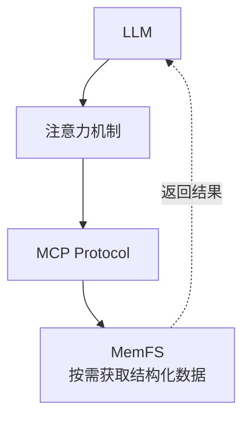

# 🧠 MemFS

**基于 MCP server-memory 深度重构的知识图谱管理系统**

> 💡 致谢：[原版 @modelcontextprotocol/server-memory](https://www.npmjs.com/package/@modelcontextprotocol/server-memory)  
> 虽然已经"大开刀"，但灵感源自于此。

[](https://nodejs.org)

---

## 🎯 一句话概括

**将现代文件系统的核心概念迁移到知识图谱管理，结合 BM25 + 模糊搜索实现智能检索，专为 LLM 辅助人文社科研究设计。**

---

## 🚀 快速开始

### 前置条件

```bash
# 确认 Node.js 版本
node --version  # 必须是 v22.0.0 或更高版本
```

### 安装与运行

```bash
# 1. 克隆或下载项目
cd MemFS

# 2. 安装依赖
npm install

# 3. 运行服务器
node index.js

# 或者指定自定义存储路径
MEMORY_DIR=~/my-knowledge
MEMORY_FILE_PATH=./custom/memory.jsonl
```

### 配置为 MCP 服务器

**VS Code / Claude Code 格式：**

```json
{
  "mcpServers": {
    "memory": {
      "command": "node",
      "args": ["/path/to/MemFS"],
      "enabled": true
    }
  }
}
```

**OpenCode 格式：**

```json
{
  "mcpServers": {
    "memory": {
      "type": "local",
      "command": ["node", "/path/to/MemFS"],
      "enabled": true
    }
  }
}
```

---

## 📖 核心概念

| 概念                   | 说明        | 类比    |
| -------------------- | --------- | ----- |
| **实体 (Entity)**      | 知识图谱中的节点  | 文件    |
| **观察 (Observation)** | 实体的属性/描述  | inode |
| **关系 (Relation)**    | 实体间的连接    | 软链接   |
| **引用 (Reference)**   | 实体指向观察的指针 | 硬链接   |

---

## 💡 核心设计思想

### 1. 适配 Transformer：按需获取



**核心理念**：不把所有知识塞进上下文，而是按需获取。

### 2. 轻量化设计

| 维度   | 传统方案         | MemFS       |
| ---- | ------------ | ----------- |
| 部署   | 数据库 + 向量引擎   | 纯 Node.js   |
| 资源   | GPU 推荐，内存占用大 | CPU 即可      |
| 可解释性 | 黑盒模型         | BM25 透明可控 |

### 3. 本地化 JSONL 存储

```jsonl
{"type":"entity","name":"韦伯","entityType":"人物","definition":"德国社会学家","observationIds":[1,2]}
{"type":"observation","id":1,"content":"《新教伦理与资本主义精神》作者","createdAt":"2024-01-15"}
{"type":"relation","from":"韦伯","to":"涂尔干","relationType":"并称"}
```

**优势**：可用任何文本编辑器打开、可放入 Git 版本控制、可打印。

### 4. 人文社科定制

| 需求类型 | 传统方案 | MemFS      |
| ---- | ---- | ---------- |
| 知识单元 | 函数/类 | 概念/人物/文献   |
| 关联模式 | 调用关系 | 影响/引用/对比关系 |
| 更新频率 | 高频   | 低频增补、高频引用  |

---

## 📦 完整 API 工具清单（16个）

### 创建类

| 工具               | 功能              | 示例         |
| ---------------- | --------------- | ---------- |
| `createEntity`   | 批量创建实体（可同步添加观察） | 添加概念、人物、文献 |
| `createRelation` | 建立实体间的关联关系      | 标记引用、对比、影响 |
| `addObservation` | 向已有实体添加观察内容     | 补充阅读笔记     |

### 读取类

| 工具                | 功能              | 示例        |
| ----------------- | --------------- | --------- |
| `searchNode`      | BM25 + 模糊混合检索 | 智能搜索相关知识  |
| `readNode`        | 读取指定实体的完整信息     | 获取详细属性和关联 |
| `readObservation` | 根据 ID 批量读取观察    | 核查具体观察内容  |
| `listNode`        | 列出所有实体概览        | 浏览知识库结构   |
| `listGraph`       | 读取整个知识图谱        | 批量导出、迁移   |
| `howWork`         | 获取推荐工作流指导       | 了解系统使用方法  |

### 更新类

| 工具                  | 功能                      | 示例        |
| ------------------- | ----------------------- | --------- |
| `updateNode`        | 更新实体及其观察（Copy-on-Write） | 修改定义、更新笔记 |
| `updateObservation` | 批量更新观察内容                | 批量修正信息    |

### 删除类

| 工具                     | 功能           | 示例     |
| ---------------------- | ------------ | ------ |
| `deleteEntity`         | 删除实体及关联关系    | 移除过时条目 |
| `deleteRelation`       | 删除特定关系       | 解除关联   |
| `deleteObservation`    | 解除观察链接（保留观察） | 移除引用   |
| `getOrphanObservation` | 查找孤儿观察       | 发现无效数据 |
| `recycleObservation`   | 回收并永久删除观察    | 清理无用数据 |

---

## 🔍 混合搜索（searchNode）

### 核心特性

| 特性         | 说明                       |
| ---------- | ------------------------ |
| **BM25** | 考虑词频和文档频率，返回语义相关结果       |
| **模糊搜索**   | 容忍拼写错误，支持近似匹配            |
| **查询分词**   | 自动分词、独立检索、聚合去重           |
| **加权融合**   | BM25 0.7 + 模糊 0.3，综合排序 |

### 参数配置

```javascript
// 默认混合搜索
await searchNode("功能主义");  // BM25 + 模糊

// 传统关键词搜索
await searchNode("功能主义", { basicFetch: true });

// 自定义参数
await searchNode("社会学", {
    limit: 15,          // 返回数量
    bm25Weight: 0.7,  // BM25 权重
    fuzzyWeight: 0.3,   // 模糊搜索权重
    minScore: 0.01      // 最小相关性阈值
});
```

### 字段权重

| 字段          | 权重  | 说明        |
| ----------- | --- | --------- |
| name        | 3.0 | 最高 - 实体名称 |
| entityType  | 2.0 | 实体类型      |
| definition  | 2.0 | 定义描述      |
| observation | 2.0 | 观察内容      |

---

## 🔧 文件系统设计思想

### 架构类比

| 文件系统概念      | MemFS 实现      | 解决的问题 |
| ----------- | ------------- | ----- |
| **Inode 表** | 观察集中存储        | 数据冗余  |
| **硬链接**     | 多实体引用同一观察     | 共享复用  |
| **软链接**     | 实体关系          | 灵活关联  |
| **写时复制**    | Copy-on-Write | 并发安全  |
| **孤儿检测**    | 孤立观察清理        | 资源回收  |

### 观察共享机制

```javascript
// 创建两个共享同一观察的实体
await createEntity([
  { name: "张三", observations: ["程序员"] },
  { name: "李四", observations: ["程序员"] }
]);

// 底层：复用同一个观察 ID
{
  entities: [
    { name: "张三", observationIds: [1] },
    { name: "李四", observationIds: [1] }
  ],
  observations: [
    { id: 1, content: "程序员" }
  ]
}
```

### Copy-on-Write

```javascript
// 更新被共享的观察
await updateNode({
  entityName: "张三",
  observationUpdates: [
    { oldContent: "程序员", newContent: "资深程序员" }
  ]
});

// 结果：张三获得新观察，李四保持原观察
{
  observations: [
    { id: 1, content: "程序员" },      // 李四使用
    { id: 2, content: "资深程序员" }     // 张三新观察
  ]
}
```

---

## 📁 数据格式

### JSONL 存储

```jsonl
{"type":"entity","name":"韦伯","entityType":"人物","definition":"德国社会学家","definitionSource":"Wikipedia","observationIds":[1,2]}
{"type":"observation","id":1,"content":"《新教伦理与资本主义精神》作者","createdAt":"2024-01-15 10:30:00+0800"}
{"type":"observation","id":2,"content":"与涂尔干、马克思并称社会学三大奠基人","createdAt":"2024-01-15 10:30:00+0800"}
{"type":"relation","from":"韦伯","to":"涂尔干","relationType":"并称"}
```

### 存储位置

| 方式    | 路径                                     |
| ----- | -------------------------------------- |
| 默认    | `~/.memory/memory.jsonl`               |
| 自定义目录 | `MEMORY_DIR=/path/to/data`             |
| 自定义路径 | `MEMORY_FILE_PATH=/path/to/file.jsonl` |

---

## 🧪 测试

```bash
# 完整测试套件（45个测试）
node test_full.mjs

# 混合搜索测试（38个测试）
node test_hybrid_search.mjs

# 观察搜索测试
node test_observation_search.mjs
```

---

## ⚙️ 与原版 MCP Memory 对比

| 维度            | 原版     | MemFS         |
| ------------- | ------ | ------------- |
| **观察存储**      | 嵌入实体内部 | 集中存储 + ID引用   |
| **数据共享**      | 不支持    | 硬链接式共享        |
| **更新机制**      | 直接覆盖   | Copy-on-Write |
| **检索能力**      | 简单关键词  | BM25 + 模糊搜索 |
| **孤立检测**      | 无      | 支持            |
| **缓存机制**      | 无      | 30秒TTL        |
| **Windows兼容** | 未知     | 优雅降级          |

---

## 📚 设计理念

**什么？你还在看？好吧，你赢了。**

坦白说，这个项目的起源是这样的：

1. **LLM 上下文有限** —— 不能把所有知识塞进 prompt
2. **文件系统是个伟大的发明** —— 处理"多数据共享同一内容"已非常成熟
3. **人文社科研究的特殊需求** —— 概念、文献、引用关系
4. **可控性比 SOTA 重要** —— 不需要黑盒向量模型

所以：

- **文件系统智慧借鉴过来**：inode 表、硬链接、写时复制
- **搜索用 BM25 + 模糊**：轻量、可解释、透明可控
- **工具化暴露**：16 个 MCP 工具，LLM 按需调用

**结果？** —— 一个安静、高效、不打扰的知识管理工具。

---

## 📄 许可证

Apache License 2.0

---

**用文件系统的方式管理知识，让混乱变得有序。**
