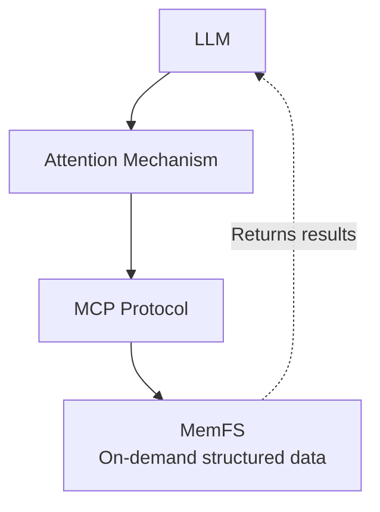

# 🧠 MemFS

**A knowledge graph management system based on MCP server-memory, deeply refactored with filesystem-inspired design**

> 💡 Acknowledgments: [Original @modelcontextprotocol/server-memory](https://www.npmjs.com/package/@modelcontextprotocol/server-memory)  
> Inspired by it, though heavily reimagined.

[](https://nodejs.org)
[](./docs/README_zh-CN.md)

---

## 🎯 One-Line Description

**Bringing modern filesystem concepts to knowledge graph management, combined with BM25 + fuzzy search for intelligent retrieval, designed for LLM-assisted humanities and social sciences research.**

---

## 🚀 Quick Start

### Prerequisites

```bash
# Check Node.js version
node --version  # Must be v22.0.0 or higher
```

### Installation & Run

**Quickest way (npx):**
```bash
npx @qty/memfs
```

**Or clone and run:**
```bash
# 1. Clone or download the project
cd MemFS

# 2. Install dependencies
npm install

# 3. Run server
node index.js

# Or with CLI args (recommended)
node index.js --memory-dir ~/my-knowledge --git-autocommit --duplicates --autogc

# Or via environment variables (legacy)
MEMORY_DIR=~/my-knowledge GITAUTOCOMMIT=true node index.js
```

### Configure as MCP Server

**OpenCode format:**
```json
{
  "mcpServers": {
    "memory": {
      "type": "local",
      "command": ["npx", "-y", "@qty/memfs"],
      "enabled": true
    }
  }
}
```

**VSCode / ClaudeCode / Cherry Studio / AstrBot format:**
```json
{
  "mcpServers": {
    "memory": {
      "command": "npx",
      "args": ["-y", "@qty/memfs"],
      "enabled": true
    }
  }
}
```

---

## 📰 What's New in v3.7.12

### CLI Args > Env Vars

All configuration now supports CLI arguments with `args > env > default` priority:

```bash
node index.js --memory-dir ~/my-knowledge --git-autocommit --duplicates --autogc
```

| Arg | Env fallback | Description |
|-----|-------------|-------------|
| `--memory-dir <path>` | `MEMORY_DIR` | Data directory |
| `--git-autocommit` | `GITAUTOCOMMIT=true` | Enable git auto-commit |
| `--mode sse` | — | Legacy SSE HTTP mode (`/sse` + `/message`) |
| `--mode http` | — | Streamable HTTP mode (`/mcp`) |
| `--mode both` | — | SSE + Streamable HTTP on the same port |
| `--port <n>` | — | HTTP server port |
| `--token <str>` | — | HTTP auth token (query `?token=` or Bearer header) |
| `--duplicates` | — | Enable analyzeDuplicates dedup tool |
| `--autogc <N>` | — | Auto `git gc --auto` every N commits |

### HTTP Modes

Three HTTP modes share the same port and token auth (query `?token=` or `Authorization: Bearer`):

- `--mode sse` — legacy HTTP+SSE transport (`GET /sse` + `POST /message?sessionId=`), for old MCP clients
- `--mode http` — Streamable HTTP transport (`GET/POST/DELETE /mcp`, stateful sessions via the `mcp-session-id` header)
- `--mode both` — both transports on the same instance, so old and new clients can connect simultaneously

Examples: `--mode sse --port 3100 --token mytoken`, `--mode http --port 3100 --token mytoken`, `--mode both --port 3100 --token mytoken`.

### entityType Multi-Dimensional Paths

Filesystem-style taxonomy: `/社会学/人物/|/经济学/人物/` — Zod auto-formats, BM25 indexes path nodes, `listNode` returns directory tree.

### **XX** Semantic Mark Tag

Markdown bold as semantic tag — BM25 weight ×1.5, transparent to search, zero schema change.

### analyzeDuplicates Dedup Tool

BM25 mean-similarity dedup for observations/entities/relations (opt-in via `--duplicates` flag). Worker thread parallel compute, distribution histogram for threshold tuning.

### --autogc Auto-GC Counter

Fire-and-forget `git gc --auto` every N auto-commits (default 20). Keeps the git repo lean.

### 18 MCP Tools

New: `analyzeDuplicates`, `--autogc` git gc. `listNode` defaults to directory tree view.

### Time Parameter Cleanup

`time=false` omits `createdAt`/`updatedAt` entirely; `time=true` omits `updatedAt` when null.

---

## 📖 Core Concepts

| Concept | Description | Analogy |
|---------|-------------|---------|
| **Entity** | Nodes in the knowledge graph | File |
| **Observation** | Properties/descriptions of entities | inode |
| **Relation** | Connections between entities | Soft link |
| **Reference** | Pointers from entities to observations | Hard link |

---

## 💡 Core Design Philosophy

### 1. Transformer-Ready: On-Demand Retrieval


```mermaid
flowchart TD
    LLM["LLM"]
    ATT["Attention Mechanism"]
    MCP["MCP Protocol"]
    MEM["MemFS\nOn-demand structured data"]

    LLM --> ATT --> MCP --> MEM
    MEM -.-> |Returns results| LLM
```

**Core principle**: Don't stuff all knowledge into context—retrieve on demand.

### 2. Lightweight Design

| Dimension | Traditional Solution | MemFS |
|-----------|---------------------|-------|
| Deployment | Database + Vector Engine | Pure Node.js |
| Resources | GPU recommended, high memory | CPU only |
| Explainability | Black-box models | BM25 transparent & controllable |

### 3. Local JSONL Storage

```jsonl
{"type":"entity","name":"Weber","entityType":"person","definition":"German sociologist","observationIds":[1,2]}
{"type":"observation","id":1,"content":"Author of 'The Protestant Ethic'","createdAt":{"utc":"2026-02-08T13:53:07Z","timezone":"Asia/Shanghai"}}
{"type":"relation","from":"Weber","to":"Durkheim","relationType":"contemporary"}
```

**Advantages**: Editable with any text editor, Git-version-controllable, printable.

### 4. Humanities & Social Sciences Customization

| Requirement Type | Traditional | MemFS |
|-----------------|-------------|-------|
| Knowledge units | Functions/Classes | Concepts/People/Documents |
| Relationship types | Function calls | Influence/Reference/Comparison |
| Update frequency | High-frequency | Low-frequency add, high-frequency reference |

---

## 📦 Complete API Tools (18 total)

### Create

| Tool | Function | Example |
|------|----------|---------|
| `createEntity` | Batch create entities (with observations) | Add concepts, people, documents |
| `createRelation` | Create relations between entities | Mark references, comparisons, influences |
| `addObservation` | Add observations to existing entities | Supplement reading notes |

### Read

| Tool | Function | Example |
|------|----------|---------|
| `searchNode` | BM25 + Fuzzy hybrid search | Intelligent knowledge search |
| `readNode` | Read complete entity information | Get detailed attributes and relations |
| `readObservation` | Batch read observations by ID | Verify specific observations |
| `listNode` | List all entity overviews | Browse knowledge structure |
| `listGraph` | Read entire knowledge graph | Batch export, migration |
| `howWork` | Get recommended workflow guidance | Learn how to use the system |

### Update

| Tool | Function | Example |
|------|----------|---------|
| `updateNode` | Update entities and observations (Copy-on-Write) | Modify definitions, update notes |
| `updateObservation` | Batch update observation content | Batch correct information |

### Delete

| Tool | Function | Example |
|------|----------|---------|
| `deleteEntity` | Delete entities and relations | Remove outdated entries |
| `deleteRelation` | Delete specific relations | Unlink entities |
| `unlinkObservation` | Unlink observations (preserve observation) | Remove references |
| `getOrphanObservation` | Find orphan observations | Discover invalid data |
| `recycleObservation` | Permanently delete observations | Clean up unused data |

### Auxiliary

| Tool | Function | Example |
|------|----------|---------|
| `getConsole` | Get console messages and Git commit logs | View auto-commit history |
| `analyzeDuplicates` | BM25 dedup analysis (needs `--duplicates` flag) | Find near-duplicate observations |

---

## 🔍 Hybrid Search (searchNode)

### Core Features

| Feature | Description |
|---------|-------------|
| **BM25** | Considers term frequency and document frequency |
| **Fuzzy Search** | Tolerates typos, supports approximate matching |
| **Query Tokenization** | Tokenize → Search individually → Aggregate → Deduplicate |
| **Weighted Fusion** | BM25 0.7 + Fuzzy 0.3, combined ranking |

### Parameters

```javascript
// Default hybrid search
await searchNode("functionalism");  // BM25 + Fuzzy

// Traditional keyword search
await searchNode("functionalism", { basicFetch: true });

// Custom parameters
await searchNode("sociology", {
    limit: 15,          // Return count
    bm25Weight: 0.7,    // BM25 weight
    fuzzyWeight: 0.3,   // Fuzzy search weight
    minScore: 0.01      // Minimum relevance threshold
});
```

### Field Weights

| Field | Weight | Description |
|-------|--------|-------------|
| name | 5.0 | Highest - entity name |
| entityType | 2.5 | Entity type |
| definition | 2.5 | Definition description |
| definitionSource | 1.5 | Definition source |
| observation | 1.0 | Observation content |

---

## 🔧 Filesystem-Inspired Design

### Architecture Analogy

| Filesystem Concept | MemFS Implementation | Solves |
|-------------------|---------------------|--------|
| **Inode Table** | Centralized observation storage | Data redundancy |
| **Hard Links** | Multiple entities reference same observation | Shared reuse |
| **Soft Links** | Entity relations | Flexible associations |
| **Copy-on-Write** | Copy-on-Write updates | Concurrency safety |
| **Orphan Detection** | Orphan observation cleanup | Resource recovery |

### Observation Sharing

```javascript
// Create two entities sharing the same observation
await createEntity([
  { name: "Zhang San", observations: ["Programmer"] },
  { name: "Li Si", observations: ["Programmer"] }
]);

// Under the hood: same observation ID is reused
{
  entities: [
    { name: "Zhang San", observationIds: [1] },
    { name: "Li Si", observationIds: [1] }
  ],
  observations: [
    { id: 1, content: "Programmer" }
  ]
}
```

### Copy-on-Write

```javascript
// Update a shared observation
await updateNode({
  entityName: "Zhang San",
  observationUpdates: [
    { oldContent: "Programmer", newContent: "Senior Programmer" }
  ]
});

// Result: Zhang San gets new observation, Li Si keeps original
{
  observations: [
    { id: 1, content: "Programmer" },      // Li Si uses
    { id: 2, content: "Senior Programmer" } // Zhang San's new observation
  ]
}
```

---

## 📁 Data Format

### JSONL Storage

```jsonl
{"type":"entity","name":"Weber","entityType":"person","definition":"German sociologist","definitionSource":"Wikipedia","observationIds":[1,2]}
{"type":"entity","name":"Durkheim","entityType":"person","definition":"French sociologist","definitionSource":"Wikipedia","observationIds":[3]}
{"type":"observation","id":1,"content":"Author of 'The Protestant Ethic'","createdAt":{"utc":"2026-02-08T13:53:07Z","timezone":"Asia/Shanghai"}}
{"type":"observation","id":2,"content":"Contemporary with Durkheim and Marx","createdAt":{"utc":"2026-02-08T14:00:00Z","timezone":"Asia/Shanghai"},"updatedAt":{"utc":"2026-02-09T10:30:00Z","timezone":"Asia/Shanghai"}}
{"type":"observation","id":3,"content":"Author of 'The Division of Labor in Society'","createdAt":{"utc":"2026-02-08T15:00:00Z","timezone":"Asia/Shanghai"}}
{"type":"relation","from":"Weber","to":"Durkheim","relationType":"contemporary"}
```

### Storage Locations

| Method | Path |
|--------|------|
| Default | `~/.memory/memory.jsonl` |
| Custom directory | `MEMORY_DIR=/path/to/data` |

### CLI Arguments

| Arg | Env fallback | Description | Default |
|-----|-------------|-------------|---------|
| `--memory-dir <path>` | `MEMORY_DIR` | Data storage directory | `~/.memory` |
| `--git-autocommit` | `GITAUTOCOMMIT=true` | Enable Git auto-commit | `false` |
| `--duplicates` | — | Enable analyzeDuplicates dedup tool | off |
| `--autogc <N>` | — | Auto `git gc --auto` every N commits | `20` |
| `--mode sse` | — | Legacy SSE HTTP mode (`/sse` + `/message`) | stdio |
| `--mode http` | — | Streamable HTTP mode (`/mcp`) | stdio |
| `--mode both` | — | SSE + Streamable HTTP on the same port | stdio |
| `--port <n>` | — | HTTP server port | `3100` |
| `--token <str>` | — | HTTP auth token (query or Bearer) | none |

---

## 🔄 Git Auto-Sync

When enabled (`--git-autocommit` or `GITAUTOCOMMIT=true`), every save to the memory file is automatically committed to Git for version control.

```bash
# Via CLI arg (recommended)
node index.js --memory-dir /path/to/data --git-autocommit

# Via environment variable
GITAUTOCOMMIT=true node index.js
```

### Auto-GC

With `--autogc <N>`, `git gc --auto` runs automatically every N auto-commits (default 20). Fire-and-forget, non-blocking.

### Commit Format

```
auto-commit:[operationContext] at [utc:YYYY-MM-DDTHH:mm:ss.SSSZ] [tz:Asia/Shanghai]
```

Example:
```
auto-commit:[createEntity "Weber"] at [utc:2026-03-22T09:15:30.123Z] [tz:Asia/Shanghai]
auto-commit:[updateNode "Durkheim"] at [utc:2026-03-22T09:16:45.456Z] [tz:Asia/Shanghai]
auto-commit:[deleteRelation "Weber"→"Durkheim"] at [utc:2026-03-22T09:17:00.789Z] [tz:Asia/Shanghai]
```

### View Commit History

Use `getConsole` tool:

```javascript
await getConsole()
// Returns text content with buffered logs and Git commits prefixed by "[Git]"
```

---

## 📦 Legacy Version

The v1.3.0 code is available on the `legacy` branch:

```bash
git clone https://github.com/Qtgcy08/MemFS.git
cd MemFS
git checkout legacy
```


---

## 🧪 Testing

```bash
# Full test suite (29 tests, SSE skipped by default)
MEMORY_DIR=test_cache node test_mcp_full.mjs

# analyzeDuplicates dedup (standalone)
node test_mcp_dedup.mjs

# Hybrid search
MEMORY_DIR=test_cache node test_mcp_hybrid_search.mjs

# Git Sync tests
node test_gitsync.mjs

# SSE tests (opt-in)
TEST_SSE=true MEMORY_DIR=test_cache node test_mcp_full.mjs
```

---

## ⚙️ Comparison with Original MCP Memory

| Dimension | Original | MemFS |
|-----------|----------|-------|
| **Observation Storage** | Embedded in entities | Centralized + ID reference |
| **Data Sharing** | Not supported | Hard-link style sharing |
| **Update Mechanism** | Direct overwrite | Copy-on-Write |
| **Search Capability** | Simple keyword | BM25 + Fuzzy |
| **Orphan Detection** |理论上不存在孤儿观察 | Supported |
| **Cache Mechanism** | None | 30s TTL |
| **Windows Compatibility** | Unknown | Graceful degradation |

---

## 📚 Design Philosophy

**What? You're still reading? Well, alright.**

Honestly, this project started because:

1. **LLM context is limited** — can't stuff all knowledge into prompts
2. **Filesystem is a great invention** — handling "multiple data sharing same content" is mature
3. **Humanities research has special needs** — concepts, literature, citation relationships
4. **Controllability > SOTA** — no need for black-box vector models

So:

- **Borrow filesystem wisdom**: inode table, hard links, copy-on-write
- **Search uses BM25 + Fuzzy**: lightweight, explainable, transparent, controllable
- **Expose as tools**: 18 MCP tools, LLM calls on demand

**Result?** — A quiet, efficient, unobtrusive knowledge management tool.

---

## 📄 License

Apache License 2.0

---

**Manage knowledge the filesystem way—bringing order to chaos.**
