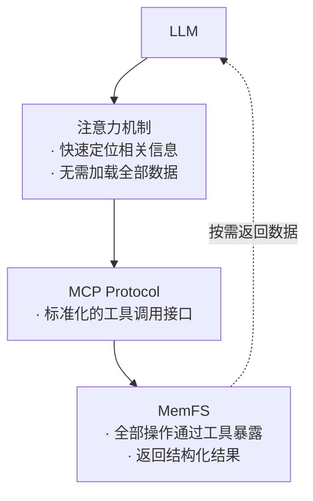
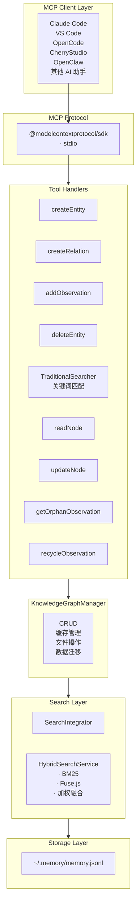
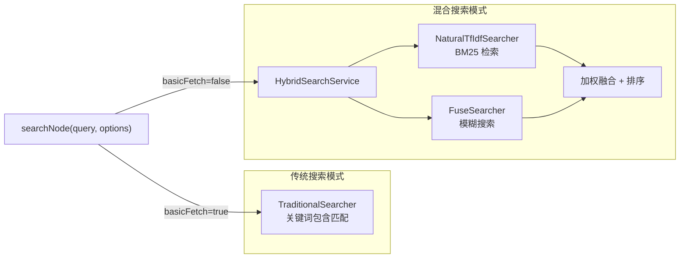

# MemFS 整体技术报告

## 一、引言：一个问题

### 1.1 传统知识图谱的困境

在大语言模型（LLM）日益普及的今天，如何让 AI 有效地存储、检索和利用用户的长期知识，成为了一个核心问题。现有的解决方案往往走向两个极端：要么过于复杂，需要部署完整的图数据库或向量检索引擎；要么过于简陋，仅能进行简单的关键词匹配。这两种方案都不适合一个个人研究者或知识工作者的日常使用。

### 1.2 设计的起点

MemFS 的设计源于一个朴素的洞察：**现代大语言模型（Transformer 架构）具有卓越的注意力机制，能够在有限的上下文窗口内高效地处理结构化信息。与此同时，文件系统作为人类最古老也最成功的抽象之一，其设计思想经过数十年的打磨，已经非常成熟。**
如果将这两个洞察结合起来——用文件系统的方式组织知识图谱，通过 MCP 协议暴露给 AI——会不会产生一种既适合 AI 调用，又便于人类管理的知识管理系统？

### 1.3 项目定位

MemFS 不是一个通用知识图谱数据库，而是一个**专为 LLM 辅助知识管理场景设计的轻量级系统**。它服务于那些需要长期积累、组织和检索知识的研究者，特别是人文社科领域的学者——他们需要处理大量的文本资料、概念辨析和文献关联。
---

## 二、核心设计思想

### 2.1 适配 Transformer 架构特性

#### 2.1.1 有限上下文与注意力机制

Transformer 架构的核心特征是**自注意力机制**——模型能够在处理当前信息时"关注"到上下文中的相关内容。然而，上下文窗口的大小是有限的。这意味着我们不能简单地将所有知识一股脑儿塞进 LLM 的上下文。
MemFS 的应对策略是"自我组织，按需获取"：让 LLM 将知识组织好，在需要时通过 MCP 工具调用获取。



**核心原则**：MemFS 不试图"记住"所有知识供 LLM 一次性读取，而是将知识组织好，让 LLM 在需要时通过工具调用获取。这种模式天然适配 LLM 的工作方式。

#### 2.1.2 全部操作通过 MCP 暴露

MemFS 的每一个功能都是一个 MCP 工具，共计 16 个工具：
| 类别     | 工具名称                   | 功能描述              | 典型使用场景      |
| ------ | ---------------------- | ----------------- | ----------- |
| **创建** | `createEntity`         | 批量创建实体（概念、人物、文献）  | 添加新知识条目     |
|        | `createRelation`       | 建立实体间的关联关系        | 标记引用、影响、对比等 |
|        | `addObservation`       | 向已有实体添加观察内容       | 补充阅读笔记、细节描述 |
| **读取** | `searchNode`           | 混合检索（BM25 + 模糊搜索） | 查找相关知识      |
|        | `readNode`             | 读取指定实体的完整信息       | 获取详细属性和关联   |
|        | `readObservation`      | 根据 ID 批量读取观察内容      | 核查具体观察内容    |
|        | `listNode`             | 列出所有实体概览          | 浏览知识库结构     |
|        | `listGraph`            | 读取整个知识图谱          | 批量导出、数据迁移   |
|        | `howWork`              | 获取推荐工作流指导         | 了解系统使用方法    |
| **更新** | `updateNode`           | 更新实体及其观察内容        | 修改定义、更新笔记   |
|        | `updateObservation`    | 批量更新观察内容          | 批量修正观察信息    |
| **删除** | `deleteEntity`         | 删除实体及关联关系         | 移除过时或错误条目   |
|        | `deleteRelation`       | 删除特定关系            | 解除实体间的关联    |
|        | `deleteObservation`    | 解除观察链接（保留观察）      | 移除实体引用      |
|        | `getOrphanObservation` | 查找孤儿观察            | 发现无效数据      |
|        | `recycleObservation`   | 回收并永久删除观察         | 清理无用数据      |
**设计理念**：每个工具做一件事，职责清晰。LLM 可以根据对话上下文选择合适的工具，就像人类研究者会查阅笔记、建立联系或整理资料一样。

### 2.2 跨平台与轻量化

#### 2.2.1 Node.js 作为运行时

选择 Node.js 作为运行环境是一个务实的决定：
| 特性         | 说明                       |
| ---------- | ------------------------ |
| 跨平台        | Windows/macOS/Linux 都能运行 |
| 生态丰富       | npm 上有大量可复用的库             |
| 异步 IO       | 适合文件操作和工具调用场景            |
| ES Modules | 现代模块系统，代码组织清晰            |
| 部署简单       | 一个文件夹 + `node` 命令        |

#### 2.2.2 极简依赖

```json
{
  "dependencies": {
    "@modelcontextprotocol/sdk": "^1.0.0",  // MCP 协议实现
    "fuse.js": "^7.1.0"                       // 模糊搜索
  }
}
```

**不依赖的（刻意为之）：**
| 排除项              | 原因           |
| ---------------- | ------------ |
| 数据库系统（SQL/NoSQL） | 增加部署复杂度      |
| 向量数据库（Milvus 等）   | 资源消耗大，需要额外服务 |
| Embedding 模型      | 依赖 GPU，黑盒不可控  |
| 复杂 NLP 库（spaCy 等）  | 过度设计，不符合轻量原则 |
**依赖策略：**

- 检索：使用 BM25 + 模糊搜索（Fuse.js）

- 验证：使用 Zod 进行运行时类型检查

- 协议：使用官方的 MCP SDK
  
  #### 2.2.3 不依赖 Embedding 的考量
  
  向量检索和 embedding 是当前知识库的热门方案，但 MemFS 刻意不采用这一技术路线：
  
  | 维度                                                                                        | Embedding 方案         | MemFS 方案         |
  | ----------------------------------------------------------------------------------------- | -------------------- | ---------------- |
  | 部署复杂度                                                                                     | 需要向量数据库+Embedding 服务 | 纯 Node.js，单文件夹运行 |
  | 计算资源                                                                                      | GPU 推荐，内存占用大         | CPU 即可，内存占用小     |
  | 可解释性                                                                                      | 向量距离难以解释             | BM25 分数清晰可控      |
  | 可调试性                                                                                      | 黑盒模型，难以调优            | 算法参数透明           |
  | 领域适配                                                                                      | 通用模型，对专业术语效果一般       | 可针对性调整权重         |
 **核心观点**：对于人文社科研究者而言，**可控性比 SOTA 性能更重要**。他们需要知道为什么某个结果被检索出来，"知其然而知其所以然"，而不是接受一个黑盒模型的"魔术"。
  
  ### 2.3 完全本地化的 JSONL 存储
  
  #### 2.3.1 为什么是 JSONL
  
  JSONL（JSON Lines）是一种简单而优雅的格式：
  
  ```jsonl
  {"type":"entity","name":"韦伯","entityType":"人物","definition":"德国社会学家","definitionSource":"Wikipedia","observationIds":[1,2]}
  {"type":"observation","id":1,"content":"《新教伦理与资本主义精神》作者","createdAt":{"utc":"2026-02-08T13:53:07Z","timezone":"Asia/Shanghai"}}
  {"type":"observation","id":2,"content":"与涂尔干、马克思并称社会学三大奠基人","createdAt":{"utc":"2026-02-08T14:00:00Z","timezone":"Asia/Shanghai"},"updatedAt":{"utc":"2026-02-09T15:30:00Z","timezone":"Asia/Shanghai"}}
  {"type":"relation","from":"韦伯","to":"涂尔干","relationType":"并称"}
  ```
  
  **时间戳格式说明：**
  
  | 字段          | 格式                | 说明                            |
  | ----------- | ----------------- | ----------------------------- |
  | `createdAt` | `{utc, timezone}` | 创建时间（UTC ISO 8601 + IANA 时区）  |
  | `updatedAt` | `{utc, timezone}` | 更新时间（Copy-on-Write 机制，仅修改时存在） |
  | **示例：**     |                   |                               |
  
  ```json
  {
  "utc": "2026-02-08T13:53:07Z",
  "timezone": "Asia/Shanghai"
  }
  ```
  
  **API 返回格式**（本地时间）：
  
  ```json
  {
  "value": "2026-02-09 22:02:06 Asia/Shanghai",
  "type": "createdAt"
  }
  ```
  
  **JSONL 的优势：**
  
  | 优势     | 说明                          |
  | ------ | --------------------------- |
  | 人类可读   | 每行是一个完整 JSON 对象，可用任何文本编辑器打开 |
  | 流式友好   | 按行读取，无需加载整个文件到内存            |
  | 追加写入   | 适合日志型数据，不会破坏已有内容            |
  | 版本控制友好 | diff 清晰，便于追溯变更              |
  | 可打印    | 即使打印成纸质文档也易于阅读              |
  
  #### 2.3.2 本地存储的意义
  
  | 维度                                                              | 说明                                      |
  | --------------------------------------------------------------- | --------------------------------------- |
  | **存储位置**                                                        | `~/.memory/memory.jsonl`（默认），可通过环境变量自定义 |
  | **备份方式**                                                        | 复制粘贴即可备份、可放入 Git 版本控制、可同步到云端（Dropbox 等） |
  | **故障恢复**                                                        | 纯文本格式，无数据库依赖；即使 Node.js 崩溃，文件仍然完整       |
  | **对于研究者而言**：他们的知识库是珍贵的数字资产，不应该被锁定在任何特定的技术栈中。JSONL 确保了数据的长期可访问性。 |                                         |
  
  ### 2.4 人文社科研究需求定制
  
  #### 2.4.1 知识结构的特殊需求
  
  人文社科研究与软件开发有本质不同的知识管理需求：
  
  | 需求类型  | 软件开发      | 人文社科研究         |
  | ----- | --------- | -------------- |
  | 知识单元  | 函数、类、模块   | 概念、人物、文献、理论    |
  | 关联模式  | 调用关系、继承关系 | 影响关系、引用关系、对比关系 |
  | 时间维度  | 版本迭代      | 历史脉络、发展演变      |
  | 更新频率  | 高频更新      | 低频增补、高频引用      |
  | 精确性要求 | 运行正确      | 引用准确、概念清晰      |
  
  #### 2.4.2 数据模型的定制
  
  MemFS 的数据模型直接反映了人文社科研究的思维方式：
  
  | 数据类型        | 结构                                                                 | 说明            |
  | ----------- | ------------------------------------------------------------------ | ------------- |
  | **实体**      | `{name, entityType, definition, definitionSource, observationIds}` | 概念/人物/文献的主体记录 |
  | **观察**      | `{id, content, createdAt, updatedAt}`                              | 实体的补充信息、笔记、描述 |
  | **关系**      | `{from, to, relationType}`                                         | 实体之间的语义关联     |
  | **核心设计洞察**： |                                                                    |               |
1. **实体名称唯一**：每个概念、人物、文献有且只有一个"主条目"

2. **观察外部化**：观察内容独立存储，实体只保存 ID 引用

3. **多对多关系**：任何实体之间都可以建立任意关系
   
   #### 2.4.3 研究工作流支持
   
   MemFS 的工具设计直接对应人文社科研究的典型工作流程：
   
   | 研究阶段    | 对应工具                                                       | 操作              |
   |:------- | ---------------------------------------------------------- | --------------- |
   | 文献阅读与笔记 | `createEntity` + `addObservation`                          | 建立概念卡片，添加阅读笔记   |
   | 概念辨析与关联 | `createRelation` + `searchNode`                            | 发现概念间的联系，建立知识网络 |
   | 写作引用与核查 | `readNode`                                                 | 快速查阅引用，确保来源可靠   |
   | 定期整理与更新 | `updateNode` + `getOrphanObservation`+`recycleObservation` | 修正过时内容，清理冗余笔记   |
   
   ### 2.5 文件系统设计思想的引入
   
   #### 2.5.1 类比与映射
   
   MemFS 的核心创新在于将文件系统的设计思想引入知识图谱管理：
   
   | 文件系统概念     | MemFS 实现         | 解决的问题      |
   | ---------- | ---------------- | ---------- |
   | Inode 表    | 观察集中存储           | 数据冗余、重复存储  |
   | 硬链接        | 多实体引用同一观察        | 相同描述的共享与复用 |
   | 软链接        | 实体关系             | 概念间的灵活关联   |
   | 写时复制 (CoW) | Copy-on-Write 更新 | 并发修改时的数据一致 |
   | TRIM 垃圾回收  | 孤儿观察发现与清理        | 资源泄漏与数据整洁  |
   | 文件元数据      | 双时间戳机制           | 知识演进追踪     |
   
   #### 2.5.2 Inode 表模式：观察外部化
   
   **传统方式的问题：**
   
   ```javascript
   // ❌ 传统方式：每个实体自带观察副本 → 数据冗余
   [
   { name: "韦伯", observations: ["《新教伦理...》作者", "社会学奠基人"] },
   { name: "涂尔干", observations: ["《社会分工论》作者", "社会学奠基人"] }
   ]
   ```
   
   如果"社会学奠基人"这个描述要修改，需要同时修改两个实体。
   **MemFS 的方案：**
   
   ```javascript
   // ✅ Inode 表模式：观察集中存储，实体通过 ID 引用
   {
   entities: [
    { name: "韦伯", observationIds: [1] },
    { name: "涂尔干", observationIds: [2, 3] }
   ],
   observations: [
    { id: 1, content: "《新教伦理与资本主义精神》作者" },
    { id: 2, content: "《社会分工论》作者" },
    { id: 3, content: "社会学奠基人" }
   ]
   }
   ```
   
   #### 2.5.3 硬链接：观察共享机制
   
   ```javascript
   // 场景：两个研究者都记录了同一个事实
   await createEntity([
   { name: "张三", observations: ["程序员"] },
   { name: "李四", observations: ["程序员"] }
   ]);
   // 底层：两个实体引用同一个观察 ID
   {
   entities: [
    { name: "张三", observationIds: [1] },
    { name: "李四", observationIds: [1] }
   ],
   observations: [
    { id: 1, content: "程序员" }
   ]
   }
   ```
   
   这种设计的优势是写时复制（Copy-on-Write）的基础。
   
   #### 2.5.4 写时复制（Copy-on-Write）
   
   当需要修改一个被多个实体共享的观察时，MemFS 自动创建新副本，避免影响其他实体：
   
   ```javascript
   // 场景：张三的"程序员"要改为"资深程序员"
   await updateNode({
   entityName: "张三",
   observationUpdates: [
    { oldContent: "程序员", newContent: "资深程序员" }
   ]
   });
   // 结果：张三获得新观察 ID，李四保持原观察 ID
   {
   entities: [
    { name: "张三", observationIds: [4] },
    { name: "李四", observationIds: [1] }
   ],
   observations: [
    { id: 1, content: "程序员" },      // 李四仍在使用
    { id: 4, content: "资深程序员" }     // 张三的新观察
   ]
   }
   ```
   
   **重要意义**：这使得多个实体可以独立地丰富或修正共享知识，而不会产生冲突。
   
   #### 2.5.5 孤儿检测与垃圾回收
   
   随着时间推移，有些观察可能不再被任何实体引用（可能是误操作删除了链接）。MemFS 提供了孤儿检测机制：
   
   ```javascript
   // 获取所有孤儿观察
   await getOrphanObservation();
   // 返回：[{ id: 5, content: "某个被遗忘的观察" }]
   // 可以安全删除
   await recycleObservation([5]);
   ```
   
   这类似于文件系统的 TRIM 磁盘清理，帮助保持知识库的整洁。

---

## 三、技术架构详解

### 3.1 系统架构图



### 3.2 核心模块说明

#### 3.2.1 KnowledgeGraphManager

这是系统的核心管理器，负责：
| 功能 | 说明 |
|------|------|
| 数据持久化 | 从 JSONL 文件读取/写入数据 |
| 缓存管理 | 30 秒 TTL 缓存，减少重复 I/O |
| 数据迁移 | 自动处理旧格式到新格式的迁移 |
| 业务逻辑 | 实体/观察/关系的增删改查 |

#### 3.2.2 SearchIntegrator：检索层的统一入口



**设计要点：**

- 懒加载索引：HybridSearchService 的索引在首次搜索时构建，之后复用

- 参数可配置：返回数量、权重、阈值都可调整

- 模式切换：通过 `basicFetch` 参数在混合搜索和传统搜索间切换
  
  #### 3.2.3 混合搜索实现
  
  详见《searchNode 技术报告》，核心流程：
  
  ```
  查询 → 分词 → BM25 搜索 → 模糊搜索 → 聚合 → 加权融合 → 排序 → 返回
  ```
  
  ### 3.3 数据流程示例
  
  以"添加一个概念并建立关联"为例：
  **步骤 1：创建实体**
  
  | 阶段            | 内容                                                                                          |
  | ------------- | ------------------------------------------------------------------------------------------- |
  | 输入            | `{name: "功能主义", entityType: "理论", definition: "...", observations: ["由涂尔干开创", "与符号互动论对立"]}` |
  | 处理            | 解析观察 → 创建观察记录（包含 createdAt 时间戳）→ 分配 ID(100,101) → 创建实体 → 写入 JSONL                           |
  | 输出            | 3 条 JSONL 记录（1 实体 + 2 观察）                                                                   |
  | **步骤 2：建立关联** |                                                                                             |
  | 阶段            | 内容                                                                                          |
  | ------        | ------                                                                                      |
  | 输入            | `{from: "功能主义", to: "涂尔干", relationType: "开创"}`                                             |
  | 处理            | 验证实体存在 → 创建关系 → 追加到 JSONL                                                                   |
  | 输出            | 1 条 JSONL 记录（关系）                                                                            |
  | **步骤 3：搜索验证** |                                                                                             |
  | 阶段            | 内容                                                                                          |
  | ------        | ------                                                                                      |
  | 输入            | `searchNode("功能主义")`                                                                        |
  | 输出            | 实体 + 观察 + 关系                                                                                |

---

## 四、与原版 MCP Memory Server 的对比

### 4.1 设计理念的演进

| 维度         | 原版 MCP Memory | MemFS (深度重构版) |
| ---------- | ------------- | ------------- |
| 观察存储       | 嵌入实体内部        | 集中存储 + ID 引用  |
| 数据共享       | 不支持           | 硬链接式共享        |
| 更新机制       | 删除 + 重建       | Copy-on-Write |
| 内容检索       | 字符串匹配         | 混合检索能力        |
| 孤儿检测       | 理论上不存在孤儿观察    | 支持            |
| 缓存机制       | 无             | 30 秒 TTL      |
| Windows 兼容 | 未知            | 优雅降级          |
| 时间戳        | 无             | 双时间戳机制        |

### 4.2 架构差异

| 对比项  | 原版 MCP Memory                     | MemFS                                     |
| ---- | --------------------------------- | ----------------------------------------- |
| 观察存储 | 嵌入实体内部 (`observations: [string]`) | 集中存储 + ID 引用 (`observationIds: [number]`) |
| 数据结构 | 单层 JSON 对象                        | 实体 - 观察分离设计                               |
| 观察格式 | 字符串数组                             | `{id, content, createdAt}` 对象             |

### 4.3 迁移与兼容

MemFS 支持从原版格式自动迁移：

```javascript
// 检测到旧格式时自动转换
if (needsMigration) {
    console.error('DETECTED: Old entity format, migrating...');
    // 将内嵌 observations 转换为集中存储
    // 保留所有数据完整性
}
```

---

## 五、设计决策与权衡

### 5.1 为什么选择这些技术

| 决策             | 替代方案           | 选择理由                 |
| -------------- | -------------- | -------------------- |
| JSONL 格式       | SQLite/JSON 文件 | 人类可读、可版本控制、无锁问题      |
| BM25 + Fuse.js | 向量召回           | 算法透明，轻量级，高性能         |
| 30 秒缓存         | 无缓存/持久缓存       | 平衡 I/O 与数据新鲜度        |
| MCP 协议         | 自定义 API        | 标准化、官方兼容，与 AI 助手天然集成 |

### 5.2 有意为之的限制

- **不支持并发写入**：单进程 MCP 服务器，简化锁逻辑

- **不支持复杂查询**：只提供基本的关系过滤

- **不支持实时同步**：依赖文件系统作为"真相源"
  
  ### 5.3 未来可能的扩展方向
  
  | 方向     | 说明                              |
  | ------ | ------------------------------- |
  | Git 联动 | 版本控制、云同步、分布式协作                  |
  | 可视化    | 生成知识图谱 DOT/Graphviz/Markmind  文件 |
  | 导入导出   | 支持常见格式（Markdown、CSV、BibTeX）     |

---

## 六、总结：为什么这个设计有效

### 6.1 对用户的价值

| 价值    | 说明                       |
| ----- | ------------------------ |
| 零学习成本 | 不需要学习复杂的数据库操作            |
| 数据可控  | 所有数据都是可读的 JSON，可以随时备份和迁移 |
| AI 友好 | 天然适配 LLM 的调用模式，按需获取信息    |
| 研究友好  | 直接对应人文社科研究的思维习惯          |

### 6.2 技术上的成功要素

- **简单优于复杂**：用成熟简单技术解决实际问题

- **人类优先**：可读性、可调试性优先于极致性能

- **边界清晰**：每个工具只做一件事，职责分明

- **渐进增强**：从简单关键词匹配平滑升级到混合检索
  
  ### 6.3 核心思想的提炼
  
  | 核心思想           | 说明                  |
  | -------------- | ------------------- |
  | 适配 Transformer | 按需获取，不是一次性灌输        |
  | 轻量化设计          | 不依赖重型基础设施，单文件夹运行    |
  | 人类可读           | JSONL 格式，文本编辑器可打开   |
  | 研究者思维          | 实体 - 观察 - 关系，对应概念卡片 |
  | 文件系统智慧         | CoW、索引、垃圾回收         |

---

MemFS 不是一个"更强大"的通用知识图谱数据库，它是一个**为特定场景（LLM 辅助人文社科研究）深度定制的工具。** 它的价值不在于技术上的先进性，而在于对用户需求的精准把握和对技术选型的务实决策。
**最终愿景**：研究者可以专注于思考和写作，把知识的存储、检索和整理交给 MemFS——一个安静、高效、不打扰的工具。