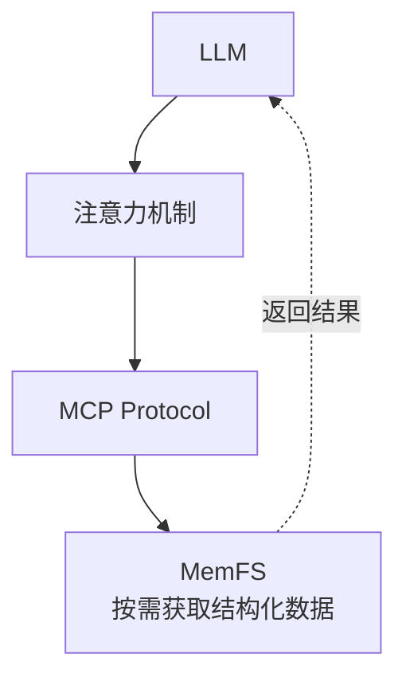

# 🧠 MemFS

**基于 MCP server-memory 深度重构的知识图谱管理系统**

> 💡 致谢：[原版 @modelcontextprotocol/server-memory](https://www.npmjs.com/package/@modelcontextprotocol/server-memory)  
> 虽然已经"大开刀"，但灵感源自于此。

[](https://nodejs.org)

---

## 🎯 一句话概括

**将现代文件系统的核心概念迁移到知识图谱管理，结合 BM25 + 模糊搜索实现智能检索，专为 LLM 辅助人文社科研究设计。**

---

## 🚀 快速开始

### 前置条件

```bash
# 确认 Node.js 版本
node --version  # 必须是 v22.0.0 或更高版本
```

### 安装与运行

**最快方式 (npx)：**
```bash
npx @qty/memfs
```

**或克隆运行：**
```bash
# 1. 克隆或下载项目
cd MemFS

# 2. 安装依赖
npm install

# 3. 运行服务器
node index.js

# 或使用 CLI 参数（推荐）
node index.js --memory-dir ~/my-knowledge --git-autocommit --duplicates --autogc

# 或使用环境变量（旧方式）
MEMORY_DIR=~/my-knowledge GITAUTOCOMMIT=true node index.js
```

### 配置为 MCP 服务器

**VSCode / ClaudeCode / Cherry Studio / AstrBot 格式：**
```json
{
  "mcpServers": {
    "memory": {
      "command": "npx",
      "args": ["-y", "@qty/memfs"],
      "enabled": true
    }
  }
}
```

**OpenCode 格式：**
```json
{
  "mcpServers": {
    "memory": {
      "type": "local",
      "command": ["npx", "-y", "@qty/memfs"],
      "enabled": true
    }
  }
}
```

---

## 📰 v3.7.12 更新公告

### CLI 参数 > 环境变量

所有配置现支持 CLI 参数，优先级 `args > env > default`：

```bash
node index.js --memory-dir ~/my-knowledge --git-autocommit --duplicates --autogc
```

| 参数 | 环境变量 | 说明 |
|------|---------|------|
| `--memory-dir <path>` | `MEMORY_DIR` | 数据目录 |
| `--git-autocommit` | `GITAUTOCOMMIT=true` | 启用 Git 自动提交 |
| `--mode sse` | — | SSE HTTP 模式 |
| `--port <n>` | — | SSE 端口 |
| `--token <str>` | — | SSE 认证 token |
| `--duplicates` | — | 启用 analyzeDuplicates 查重工具 |
| `--autogc <N>` | — | 自动 `git gc --auto`（默认 20 次提交） |

### SSE 模式

HTTP SSE 传输层 + token 认证 — `--mode sse --port 3100 --token mytoken`。

### entityType 多维路径

文件系统风格分类：`/社会学/人物/|/经济学/人物/` — Zod 自动格式化，BM25 索引路径节点，`listNode` 返回目录树。

### **XX** 语义标记

Markdown 加粗作为语义标签 — BM25 权重 ×1.5，检索透明，零 Schema 改动。

### analyzeDuplicates 查重工具

基于 BM25 均值相似度的语义查重（`--duplicates` flag 按需启用）。Worker 线程并行计算，分布直方图辅助阈值调优。

### --autogc 自动 GC

Fire-and-forget `git gc --auto`，每 N 次 auto-commit 触发（默认 20）。保持 Git 仓库瘦身。

### 18 个 MCP 工具

新增：`analyzeDuplicates`、`--autogc`。`listNode` 默认返回目录树视图。

### Time 参数清理

`time=false` 完全省略 `createdAt`/`updatedAt`；`time=true` 时 `updatedAt` 为 null 不输出。

---

## 📖 核心概念

| 概念                   | 说明        | 类比    |
| -------------------- | --------- | ----- |
| **实体 (Entity)**      | 知识图谱中的节点  | 文件    |
| **观察 (Observation)** | 实体的属性/描述  | inode |
| **关系 (Relation)**    | 实体间的连接    | 软链接   |
| **引用 (Reference)**   | 实体指向观察的指针 | 硬链接   |

---

## 💡 核心设计思想

### 1. 适配 Transformer：按需获取



**核心理念**：不把所有知识塞进上下文，而是按需获取。

### 2. 轻量化设计

| 维度   | 传统方案         | MemFS       |
| ---- | ------------ | ----------- |
| 部署   | 数据库 + 向量引擎   | 纯 Node.js   |
| 资源   | GPU 推荐，内存占用大 | CPU 即可      |
| 可解释性 | 黑盒模型         | BM25 透明可控 |

### 3. 本地化 JSONL 存储

```jsonl
{"type":"entity","name":"韦伯","entityType":"人物","definition":"德国社会学家","definitionSource":"Wikipedia","observationIds":[1,2]}
{"type":"observation","id":1,"content":"《新教伦理与资本主义精神》作者","createdAt":{"utc":"2026-02-08T13:53:07Z","timezone":"Asia/Shanghai"}}
{"type":"relation","from":"韦伯","to":"涂尔干","relationType":"并称"}
```

**优势**：可用任何文本编辑器打开、可放入 Git 版本控制、可打印。

### 4. 人文社科定制

| 需求类型 | 传统方案 | MemFS      |
| ---- | ---- | ---------- |
| 知识单元 | 函数/类 | 概念/人物/文献   |
| 关联模式 | 调用关系 | 影响/引用/对比关系 |
| 更新频率 | 高频   | 低频增补、高频引用  |

---

## 📦 完整 API 工具清单（18个）

### 创建类

| 工具               | 功能              | 示例         |
| ---------------- | --------------- | ---------- |
| `createEntity`   | 批量创建实体（可同步添加观察） | 添加概念、人物、文献 |
| `createRelation` | 建立实体间的关联关系      | 标记引用、对比、影响 |
| `addObservation` | 向已有实体添加观察内容     | 补充阅读笔记     |

### 读取类

| 工具                | 功能              | 示例        |
| ----------------- | --------------- | --------- |
| `searchNode`      | BM25 + 模糊混合检索 | 智能搜索相关知识  |
| `readNode`        | 读取指定实体的完整信息     | 获取详细属性和关联 |
| `readObservation` | 根据 ID 批量读取观察    | 核查具体观察内容  |
| `listNode`        | 列出所有实体概览        | 浏览知识库结构   |
| `listGraph`       | 读取整个知识图谱        | 批量导出、迁移   |
| `howWork`         | 获取推荐工作流程        | 学习使用 MemFS |

### 更新类

| 工具                  | 功能                      | 示例        |
| ------------------- | ----------------------- | --------- |
| `updateNode`        | 更新实体及其观察（Copy-on-Write） | 修改定义、更新笔记 |
| `updateObservation` | 批量更新观察内容                | 批量修正信息    |

### 删除类

| 工具                     | 功能           | 示例     |
| ---------------------- | ------------ | ------ |
| `deleteEntity`         | 删除实体及关联关系    | 移除过时条目 |
| `deleteRelation`       | 删除特定关系       | 解除关联   |
| `unlinkObservation`    | 解除观察链接（保留观察） | 移除引用   |
| `getOrphanObservation` | 查找孤儿观察       | 发现无效数据 |
| `recycleObservation`   | 回收并永久删除观察    | 清理无用数据 |

### 辅助工具

| 工具          | 功能                    | 示例              |
| ----------- | --------------------- | ---------------- |
| `getConsole` | 获取控制台消息和 Git 提交日志   | 查看自动提交历史     |
| `howWork`         | 获取推荐工作流指导       | 了解系统使用方法  |
| `analyzeDuplicates` | BM25 查重分析（需 `--duplicates` 参数） | 发现近似重复的观察 |

---

## 🔍 混合搜索（searchNode）

### 核心特性

| 特性         | 说明                       |
| ---------- | ------------------------ |
| **BM25** | 考虑词频和文档频率，返回语义相关结果       |
| **模糊搜索**   | 容忍拼写错误，支持近似匹配            |
| **查询分词**   | 自动分词、独立检索、聚合去重           |
| **加权融合**   | BM25 0.7 + 模糊 0.3，综合排序 |

### 参数配置

```javascript
// 默认混合搜索
await searchNode("功能主义");  // BM25 + 模糊

// 传统关键词搜索
await searchNode("功能主义", { legacyGrep: true });

// 自定义参数
await searchNode("社会学", {
    limit: 15,          // 返回数量
    bm25Weight: 0.7,  // BM25 权重
    fuzzyWeight: 0.3,   // 模糊搜索权重
    minScore: 0.01      // 最小相关性阈值
});
```

### 字段权重

| 字段 | 权重 | 说明 |
|------|------|------|
| name | 5.0 | 最高 - 实体名称 |
| entityType | 2.5 | 实体类型 |
| definition | 2.5 | 定义描述 |
| definitionSource | 1.5 | 定义来源 |
| observation | 1.0 | 观察内容 |

---

## 🔧 文件系统设计思想

### 架构类比

| 文件系统概念      | MemFS 实现      | 解决的问题 |
| ----------- | ------------- | ----- |
| **Inode 表** | 观察集中存储        | 数据冗余  |
| **硬链接**     | 多实体引用同一观察     | 共享复用  |
| **软链接**     | 实体关系          | 灵活关联  |
| **写时复制**    | Copy-on-Write | 并发安全  |
| **跨进程锁**    | `fs.mkdir` 原子锁 | 跨实例并发 |
| **孤儿检测**    | 孤立观察清理        | 资源回收  |

### 观察共享机制

```javascript
// 创建两个共享同一观察的实体
await createEntity([
  { name: "张三", observations: ["程序员"] },
  { name: "李四", observations: ["程序员"] }
]);

// 底层：复用同一个观察 ID
{
  entities: [
    { name: "张三", observationIds: [1] },
    { name: "李四", observationIds: [1] }
  ],
  observations: [
    { id: 1, content: "程序员" }
  ]
}
```

### Copy-on-Write

```javascript
// 更新被共享的观察
await updateNode({
  entityName: "张三",
  observationUpdates: [
    { oldContent: "程序员", newContent: "资深程序员" }
  ]
});

// 结果：张三获得新观察，李四保持原观察
{
  observations: [
    { id: 1, content: "程序员" },      // 李四使用
    { id: 2, content: "资深程序员" }     // 张三新观察
  ]
}
```

### 观察所有权转移

`unlinkObservation` + `addObservation`（link 模式）组合可实现观察从原实体转移到目标实体：

```javascript
// 1. 解除原实体的观察引用（观察本身保留，变为孤儿）
await unlinkObservation({ observationIds: [1], entityNames: ["张三"] });

// 2. 将同一观察链接到目标实体
await addObservation({
    mode: "link-single",
    entityName: "李四",
    observationId: 1
});
```

这种模式常用于知识归类调整：某条笔记起初归于概念 A，后续研判后认为更应归入概念 B，无需复制数据，只需转移引用。

---

## 📁 数据格式

### JSONL 存储

```jsonl
{"type":"entity","name":"韦伯","entityType":"人物","definition":"德国社会学家","definitionSource":"Wikipedia","observationIds":[1,2]}
{"type":"entity","name":"涂尔干","entityType":"人物","definition":"法国社会学家","definitionSource":"Wikipedia","observationIds":[3]}
{"type":"observation","id":1,"content":"《新教伦理与资本主义精神》作者","createdAt":{"utc":"2026-02-08T13:53:07Z","timezone":"Asia/Shanghai"}}
{"type":"observation","id":2,"content":"与涂尔干、马克思并称社会学三大奠基人","createdAt":{"utc":"2026-02-08T14:00:00Z","timezone":"Asia/Shanghai"},"updatedAt":{"utc":"2026-02-09T10:30:00Z","timezone":"Asia/Shanghai"}}
{"type":"observation","id":3,"content":"《社会分工论》作者","createdAt":{"utc":"2026-02-08T15:00:00Z","timezone":"Asia/Shanghai"}}
{"type":"relation","from":"韦伯","to":"涂尔干","relationType":"并称"}
```

### 存储位置

| 方式    | 路径                                     |
| ----- | -------------------------------------- |
| 默认    | `~/.memory/memory.jsonl`               |
| 自定义目录 | `MEMORY_DIR=/path/to/data`             |

### CLI 参数

| 参数 | 环境变量 | 说明 | 默认值 |
|------|---------|------|--------|
| `--memory-dir <path>` | `MEMORY_DIR` | 数据存储目录 | `~/.memory` |
| `--git-autocommit` | `GITAUTOCOMMIT=true` | 启用 Git 自动提交 | `false` |
| `--duplicates` | — | 启用 analyzeDuplicates 查重 | 关闭 |
| `--autogc <N>` | — | 自动 `git gc --auto` | `20` |
| `--mode sse` | — | SSE HTTP 模式 | stdio |
| `--port <n>` | — | SSE 端口 | `3100` |
| `--token <str>` | — | SSE 认证 token | 无 |

---

## 🔄 Git 自动同步

启用后（`--git-autocommit` 或 `GITAUTOCOMMIT=true`），每次保存记忆文件都会自动提交到 Git，便于追踪变更历史。

```bash
# 使用 CLI 参数（推荐）
node index.js --memory-dir /path/to/data --git-autocommit

# 使用环境变量
GITAUTOCOMMIT=true node index.js
```

### 自动 GC

`--autogc <N>` 参数可在每 N 次 auto-commit 后自动运行 `git gc --auto`（默认 20）。Fire-and-forget，不阻塞操作管线。

### 提交格式

```
auto-commit:[operationContext] at [utc:YYYY-MM-DDTHH:mm:ss.SSSZ] [tz:Asia/Shanghai]
```

示例：
```
auto-commit:[createEntity "韦伯"] at [utc:2026-03-22T09:15:30.123Z] [tz:Asia/Shanghai]
auto-commit:[updateNode "涂尔干"] at [utc:2026-03-22T09:16:45.456Z] [tz:Asia/Shanghai]
auto-commit:[deleteRelation "韦伯"→"涂尔干"] at [utc:2026-03-22T09:17:00.789Z] [tz:Asia/Shanghai]
```

### 查看提交历史

使用 `getConsole` 工具获取日志：

```javascript
await getConsole()
// 返回文本内容，包含缓冲日志和以"[Git]"前缀的Git提交记录
```

---

## 📦 旧版本

v1.3.0 代码位于 `legacy` 分支：

```bash
git clone https://github.com/Qtgcy08/MemFS.git
cd MemFS
git checkout legacy
```


---

## 🧪 测试

```bash
# 完整测试套件（29个测试，SSE 默认跳过）
MEMORY_DIR=test_cache node test_mcp_full.mjs

# analyzeDuplicates 查重（独立运行，无需 MEMORY_DIR）
node test_mcp_dedup.mjs

# 混合搜索
MEMORY_DIR=test_cache node test_mcp_hybrid_search.mjs

# Git 同步测试
node test_gitsync.mjs

# SSE 测试（需主动启用）
TEST_SSE=true MEMORY_DIR=test_cache node test_mcp_full.mjs
```

---

## ⚙️ 与原版 MCP Memory 对比

| 维度            | 原版     | MemFS         |
| ------------- | ------ | ------------- |
| **观察存储**      | 嵌入实体内部 | 集中存储 + ID引用   |
| **数据共享**      | 不支持    | 硬链接式共享        |
| **更新机制**      | 直接覆盖   | Copy-on-Write |
| **检索能力**      | 简单关键词  | BM25 + 模糊搜索 |
| **孤立检测**      | 理论上不存在孤儿观察      | 支持            |
| **缓存机制**      | 无      | 30秒TTL        |
| **Windows兼容** | 未知     | 优雅降级          |

---

## 📚 设计理念

**什么？你还在看？好吧，你赢了。**

坦白说，这个项目的起源是这样的：

1. **LLM 上下文有限** —— 不能把所有知识塞进 prompt
2. **文件系统是个伟大的发明** —— 处理"多数据共享同一内容"已非常成熟
3. **人文社科研究的特殊需求** —— 概念、文献、引用关系
4. **可控性比 SOTA 重要** —— 不需要黑盒向量模型

所以：

- **文件系统智慧借鉴过来**：inode 表、硬链接、写时复制
- **搜索用 BM25 + 模糊**：轻量、可解释、透明可控
- **工具化暴露**：18 个 MCP 工具，LLM 按需调用

**结果？** —— 一个安静、高效、不打扰的知识管理工具。

---

## 📄 许可证

Apache License 2.0

---

> **用文件系统的方式管理知识，让混乱变得有序。**
